# CI 파이프라인 구축하기

---

구축할 파이프라인 steps

1. [`PR` 생성, push 시 `Test` 결과 보여주기](#1-pr-생성-push-시-test-결과-보여주기)
2. [`Jacoco` 와 `SonarCloud` 이용해서 코드 분석 보여주기](#2-jacoco-와-sonarcloud-이용해서-코드-분석-보여주기)
3. [전체 `CI` 스크립트](#3-전체-ci-스크립트)

---

## 1. `PR` 생성, push 시 `Test` 결과 보여주기

`CI` 로 테스트 돌리기만 하는 건 너무 단조롭다. 그래서 3 가지 기능을 덧붙였다.

- [`a. actions/cache@v4.1.2`](https://github.com/actions/cache)
    - `gradle`, `sonar` 등 이전 `CI` 에서 관련 패키지 캐싱하는 `action`

- [`b. EnricoMi/publish-unit-test-result-action@v2.18.0`](https://github.com/EnricoMi/publish-unit-test-result-action)
    - `PR` 댓글에 성공, 실패한 테스트 개수 보여주는 `action`

- [`c. mikepenz/action-junit-report@v5`](https://github.com/mikepenz/action-junit-report)
    - 실패한 테스트에 `code review` 로 댓글 `(annotation?)` 달아주는 `action`

이들은 모두 `Github marketplace` 에서 바로 사용 가능한 `action` 들이다.
그래서 `Repo` 에 `secret key` 를 넣어준다던가, 어디 사이트에서 따로 설정을 해야한다던가 하지 않는다.

다만 `build.gradle` 에 한가지 부가설정이 있으면 좋다.

<!-- normal-ci-1.png -->

<p align="center">
  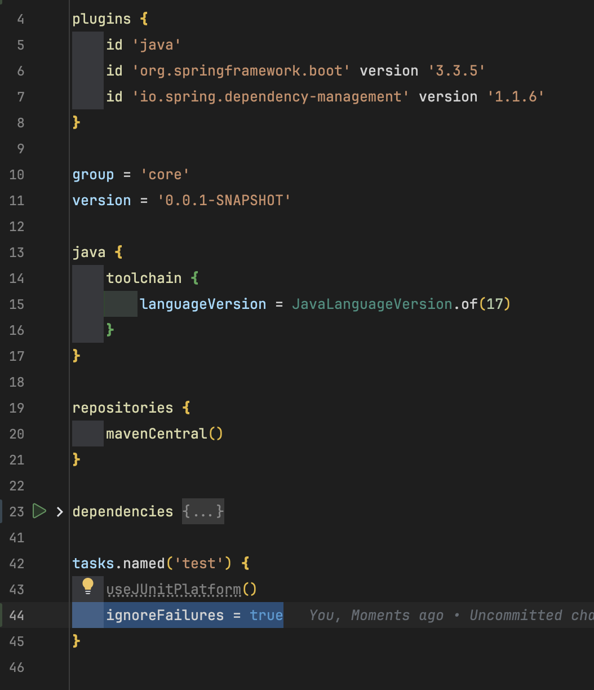
</p>

일반적으로 `gradle build` 시 자동으로 `gradle test` 또한 진행된다.

그런데 `test` 시 모든 테스트가 성공하지 않으면 `Exit code 1` 을 뱉어낸다.

<!-- normal-ci-2.png -->

<p align="center">
  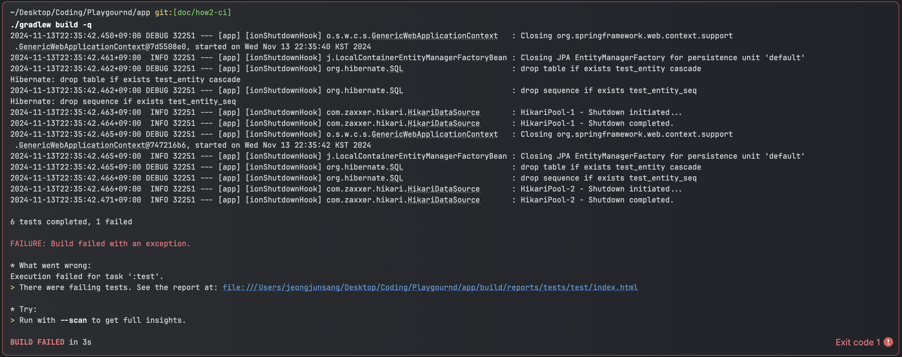
</p>

이 `Exit code 1` 은 로컬에서 문제되진 않는다. 하지만 `github` 에서 `workflow` 실행중 이라면 문제가 된다.

`workflow` 중 `Exit code 1` 이 감지되면 해당 `action` 은 더이상 수행 불가능하다 판단된다. 그래서 `Exit code 1` 이 발생하면 이후의
모든 `step` 들이 실행되지 않는 문제가 발생한다.

물론 `gradle build -x test` 처럼 `build` 시 `test` 를 돌리지 않는 방법이 있고, `workflow step`
에 `always()`, `failure()` 등 이전 `step` 이 실패했어도 실행하게 만드는 옵션이 존재한다.

하지만 이를 매번 고려해 `build` 하거나 `step` 을 수정하는 것 보다, 간단히 `ignoreFailures = true` 하는게 편할 것이다.

> 무엇보다 이후 `jacoco` 와 `sonar` 를 이용하는 부분에서 문제가 될 가능성이 높다.

<!-- normal-ci-3.png -->

<p align="center">
  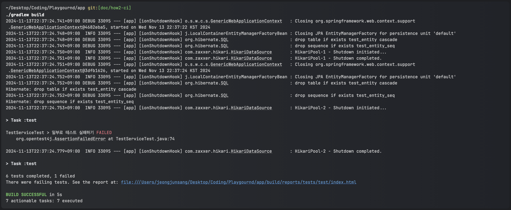
  <br>

  <body>ignoreFailures = true 설정 후, build 혹은 test 시 Exit code 1 이 나오지 않는다</body>
</p>

`build.gradle` 에 `ignoreFailures = true` 를 추가했으면 `CI` 스크립트를 작성하자.

<details><summary> ci-with-gradle.yml</summary>

```
# Workflow 이름
name: CI Report with Gradle & Sonar

# 트리거 이벤트
on:
  pull_request:
    branches: [ "main", "master", "develop", "release" ]

# 테스트 결과 작성을 위해 쓰기 권한 추가
permissions: write-all

# 실행
jobs:
  build:
    runs-on: ubuntu-latest

    # 실행 스텝
    steps:

      # workflow 가 repo 에 접근하기 위한 Marketplace action
      - uses: actions/checkout@v4.2.2

      # 우리 repo 디렉토리는 ~/ 아니라 그냥 ./ 임
      - name: Show CWD Properties
        run: |
          echo "Current directory : `pwd`"
          ls -al
          echo 'tree ./'
          tree ./ -a

      # jdk setup
      - name: Set up JDK 17
        uses: actions/setup-java@v4.5.0
        with:
          java-version: '17'
          distribution: 'oracle'  # 그냥 Oracle JDK


      # (a)
      # gradle 캐시해서 빌드 시간 단축
      - name: Gradle caching
        uses: actions/cache@v4.1.2
        with:
          # cache 저장할 폴더 설정
          path: |
            ~/.gradle/caches
            ~/.gradle/wrapper
          key: ${{ runner.os }}-gradle-${{ hashFiles('**/*.gradle*', '**/gradle-wrapper.properties') }}
          restore-keys:
            ${{ runner.os }}-gradle-


      # gradlew 실행 권한 부여
      - name: Grant Execute Permission For Gradlew
        run: |
          cd app
          chmod +x ./gradlew


      # test 없이 그냥 build
      - name: Build with Gradle
        run: |
          cd app
          ./gradlew build -x test --build-cache
      

      # 테스트 실행
      - name: Run Tests
        run: |
          cd app
          ./gradlew --info test
      

      # (b)
      # Pull Request 코멘트에 테스트 결과 댓글 달기
      - name: Publish Unit Test Results To PR Comment
        uses: EnricoMi/publish-unit-test-result-action@v2.18.0
        if: ${{ always() }}   # 앞에 step 이 fail 해도 실행
        with:
          files: app/build/test-results/**/*.xml


      # (c)
      # 테스트 실패한 부분 PR Code Review 에 주석 달기
      - name: Add Annotation to Failed Test on PR Code Review
        uses: mikepenz/action-junit-report@v5
        if: success() || failure()  # 앞에 step 이 fail 해도 실행
        with:
          # test report 위치
          report_paths: '**/build/test-results/test/*.xml'
          require_tests: true
```

</details>

---

### a. Gradle caching

- [`actions/cache@v4.1.2`](https://github.com/actions/cache)

```
# gradle 캐시해서 빌드 시간 단축
- name: Gradle caching
  uses: actions/cache@v4.1.2
  with:
    # cache 저장할 폴더 설정
    path: |
      ~/.gradle/caches
      ~/.gradle/wrapper
    key: ${{ runner.os }}-gradle-${{ hashFiles('**/*.gradle*', '**/gradle-wrapper.properties') }}
    restore-keys:
      ${{ runner.os }}-gradle-
```

위 스크립트는 이전에 실행한 `action` 중 관련된 `cache` 가 있는지 확인하고 사용하는 코드이다.

<!-- normal-ci-4.png -->

<p align="center">
  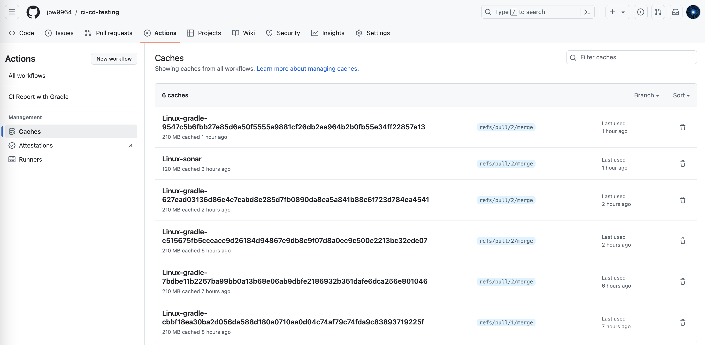
</p>

`github action` 을 보면 위 그림처럼 `cache` 가 저장된 걸 볼 수 있다.

그래서 `CI` 스크립트 실행 시, 관련된 `cache` 가 있는지 검색한다.

<!-- normal-ci-5.png, normal-ci-6.png -->

<p align="center">
  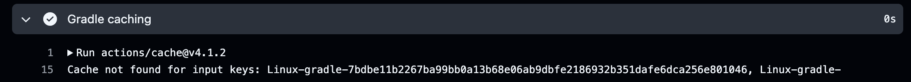

  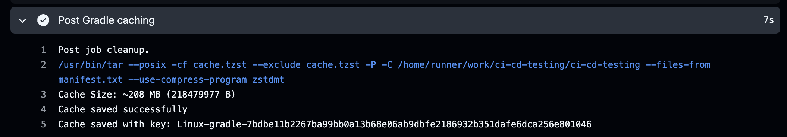
</p>

처음 `action` 이 실행되면 관련된 `cache` 가 존재하지 않는다. 그래서 위 첫번째 그림처럼 `Cache not found ...` 가 출력되는 걸 볼 수 있다.

그 이후 `action` 이 끝날 때 즈음 `Post Gradle caching` 으로 `action` 중 사용된 `gradle` 관련 파일을 `action cache` 에
저장하는 걸 볼 수 잇다.

---

### b. Publish Unit Test Results To PR Comment

- [`EnricoMi/publish-unit-test-result-action@v2.18.0`](https://github.com/EnricoMi/publish-unit-test-result-action)

```
# Pull Request 코멘트에 테스트 결과 댓글 달기
- name: Publish Unit Test Results To PR Comment
  uses: EnricoMi/publish-unit-test-result-action@v2.18.0
  if: ${{ always() }}   # 앞에 step 이 fail 해도 실행
  with:
    files: app/build/test-results/**/*.xml
```

위 스크립트는 `gradle test` 를 통해 생성된 `report` 파일로, `Test 결과` 를 `Pull Request` 댓글로 알려주는 스크립트다.

`if: ${{ always() }}` 를 통해, 앞서 `workflow step` 이 실패해도 이 `step` 을 실행한다.

또한 `files` 에 생성된 `test report` 파일을 명시하는 것을 볼 수 있다.

이것이 실행되면 아래 그림처럼 `Pull Requeset` 댓글로 `Test 결과` 가 게시되고, 실행된 `action` 에서 더 자세한 설명을 볼 수 있다.

<!-- ci-pr-comment-1.png, ci-pr-comment-2.png -->

<p align="center">
  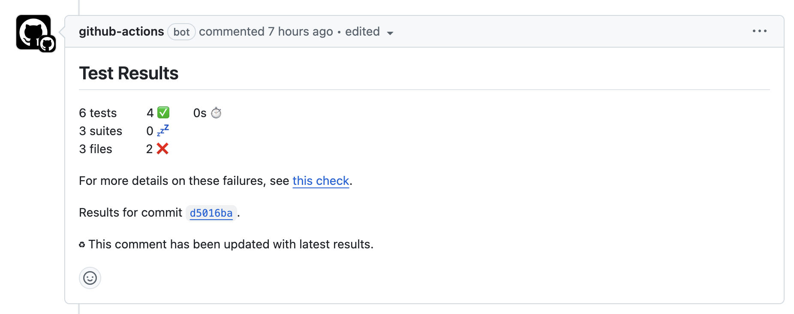

  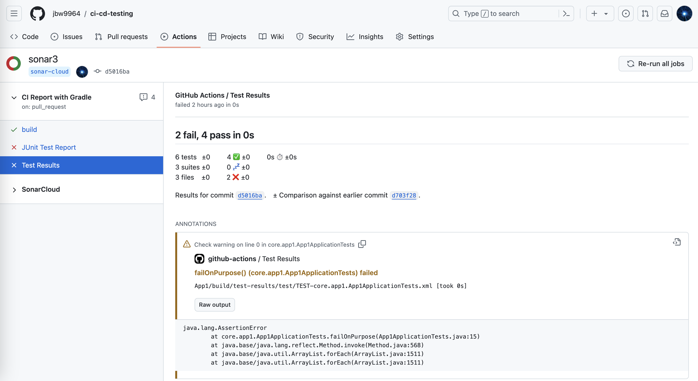
</p>

---

### c. Add Annotation to Failed Test on PR Code Review

- [`mikepenz/action-junit-report@v5`](https://github.com/mikepenz/action-junit-report)

```
# 테스트 실패한 부분 PR Code Review 에 주석 달기
- name: Add Annotation to Failed Test on PR Code Review
  uses: mikepenz/action-junit-report@v5
  if: success() || failure()  # 앞에 step 이 fail 해도 실행
  with:
    # test report 위치
    report_paths: '**/build/test-results/test/*.xml'
    require_tests: true
```

마지막으로 위 스크립은 `gradle test` 의 `report` 로 `PR Code Review` 에 댓글(?) 을 달아주는 스크립이다.

<!-- ci-code-review-annotation-1.png, ci-code-review-annotation-2.png -->

<p align="center">
  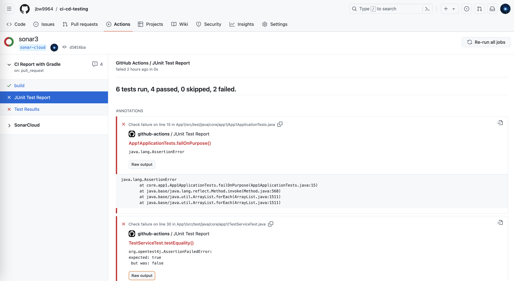

  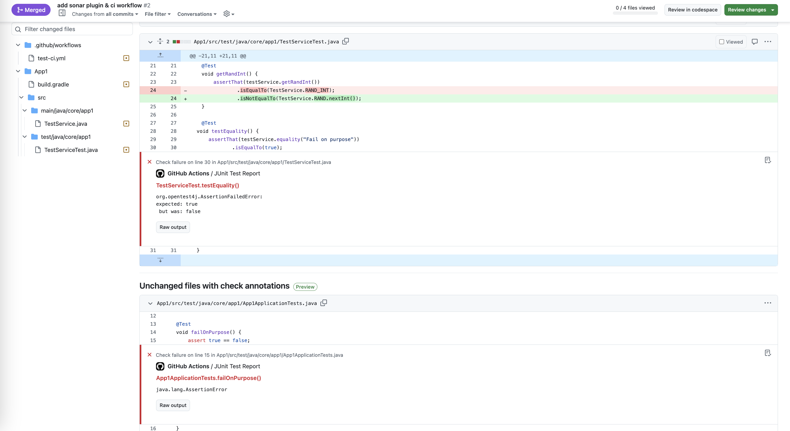
</p>

다만 한가지 이상한 점이 있다.

원인은 정확하게 파악하지 못햇는데, 만약 한 `PR` 에서 여러번 `push` 가 이뤄저 `action` 이 새로 실행될 때, 위 `annotation` 이 보일때도 있고 안보일
때도 있다.

이것이 단순히 `"action 이 실행된 commit 에서 해당 test code 들이 안보이기 때문"` 에 그런것인지, 아니면 내가 스크립트를 잘못 짠 건지 모르겠다.

---

## 2. `Jacoco` 와 `SonarCloud` 이용해서 코드 분석 보여주기

이번에는 `Jacoco` 와 `SonarCloud` 를 이용해 `(코드 분석) + (테스트 코드 Coverage 분석)` 을 진행해 보겠다.

`SonarCloud` 의 경우 사실 추가적인 스크립 `(CI script)` 구성 없이, 그냥 `"온라인 설정"` 만으로 `정적 코드 분석` 이 가능하다.

- `Security Hotspot` 탐지
- 코드 중복 탐지
- 코드 개선점 제시 등

하지만 `Code Coverage` 의 경우 `Jacoco` 등의 도구와 추가적인 `CI` 구성이 필요하다.

그래서 우린 먼저 프로젝트 모듈에 `Jacoco` 를 추가하고, 둘째로 `SonarCloud` 를 설정하도록 하겠다.

---

### a. `Gradle` 모듈에 `Jacoco` 추가하기

`Jacoco` 는 `build.gradle` 에 `plugin` 으로 모듈에 추가되고 세부 설정을 명시할 수 있다.

```
plugins {
    
    /* ... 생략 ... */

    // 테코 커버리지 분석
    id 'jacoco'
}

/* ... 생략 ... */

tasks.named('test') {
    
    /* ... 생략 ... */

    // test 실행 후 jacocoTestReport 실행 되도록
    finalizedBy 'jacocoTestReport'
}

// jacocoTestReport 구성
jacocoTestReport {
    // jacocoTestReport task 실행 시 반드시 test 먼저 실행 되도록
    dependsOn test

    // report 양식 enable
    reports {
        html.required = true
        xml.required = true
        csv.required = true
    }

    // coverage 분석에 포함시키지 않을 항목들
    // QueryDSL 로 만들어진거 나중에 포함해야 될수도
    afterEvaluate {
        classDirectories.setFrom(files(classDirectories.files.collect {
            fileTree(dir: it, excludes: [
                    "**/*Application*"
            ])
        }))
    }
}
```

위 코드를 보면 `id 'jacoco'` 로 `gradle plugin` 으로 우리 모듈에 추가됨을 볼 수 있다.

또한 `jacocoTestReport { afterEvaluate{...} }` 를 통해 `Coverage 분석` 에 제외할 파일을 명시할 수 있다.

위처럼 설정한 후 `gradle task` 를 확인해 보면 아래 그림처럼 `jacocoTestReport`, `jacocoTestCoverageVerification` 이 추가된
걸 볼 수 있다.

<!-- jacoco-config-1.png -->

<p align="center">
  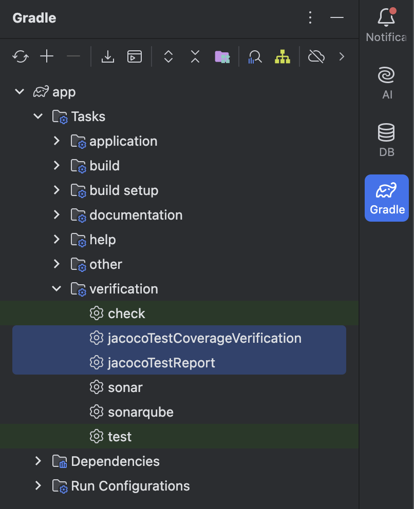
</p>

여담으로 사실 위 `build.gradle` 에 `jacocoTestCoverageVerification` 을 설정해, `"test 시 일정 coverage 이상이 되어야 통과"`
되도록 만들 수 있다.

하지만 이를 설정하고 `coverage` 가 넘지 못하면 문제의 `Exit code 1` 을 뱉어내 `CI` 실행 중 문제가 된다.

그리고 `Coverage verification` 은 `SonarCloud` 를 통해 우리 눈으로 볼 수 있으므로 위 `build.gradle` 에선 생략했다.

위처럼 설정하고 아래 명령어를 실행해 보자.

```shell
# on repository root
cd ./app
chmod +x ./gradlew
./gradlew clean test
```

<!-- jacoco-config-2.png -->

<p align="center">

  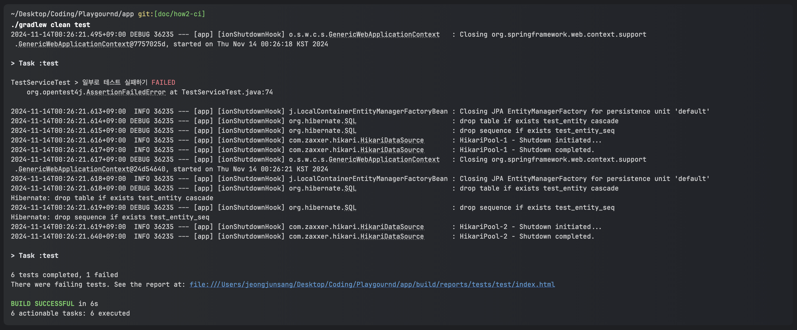

  <br>

  <body>Exit code 1 되지 않아야 한다.</body>
</p>

그 이후 `app/build/reports/jacoco/test` 폴더가 존재하는지 확인하고, 그 중 `index.html` 을 브라우저로 열어보자.

<!-- jacoco-config-3.png, jacoco-config-4.png -->

<p align="center">
  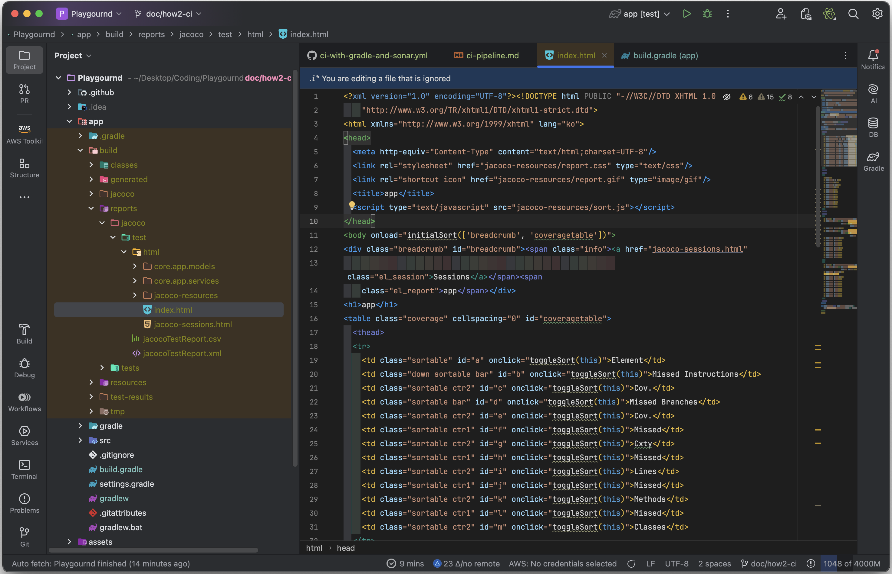

  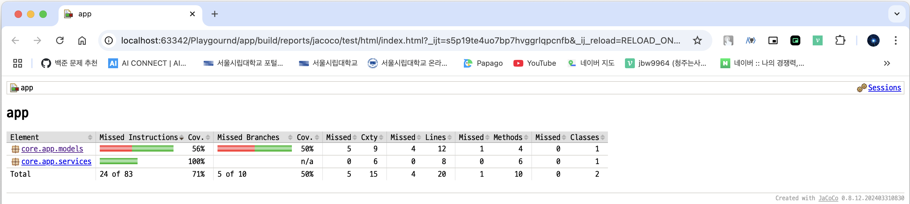
</p>

위 처럼 보이면 `jacocoTestReport` 가 잘 실행된 것이다.

---

### b. `SonarCloud` 설정하기

앞서 우리 `gradle` 모듈에 `Jacoco` 를 설정하였다. 이제 `SonarCloud` 를 추가해야 하는데, 그 전에 `SonarCloud` 와 현 `repo` 를 먼저
연결해줘야 한다.

- [`SonarQube Cloud 가입`](https://www.sonarsource.com/products/sonarcloud/signup/?_gl=1%2A191q6hj%2A_gcl_au%2ANzQzMjk0ODIuMTczMTUxMjY4OQ..%2A_ga%2AOTkwNTgxNjg0LjE3MzE1MTI2ODY.%2A_ga_9JZ0GZ5TC6%2AMTczMTUxMjY4Ni4xLjEuMTczMTUxMzU4MS41Ny4wLjA.)

<!-- sonar-cloud-pre-setup-1.png -->

<p align="center">
  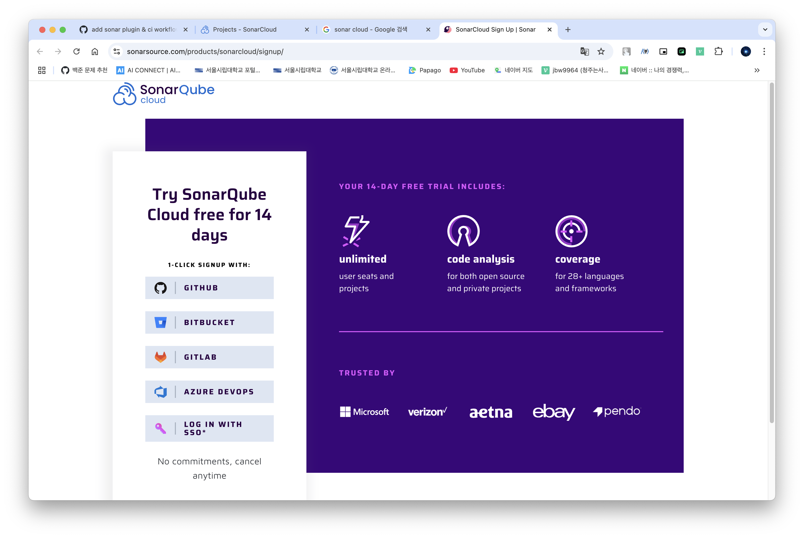
</p>

SonarCloud 에 가입해준다.

가입 후 아래처럼 보이면 `Github` 에서 `organization` 을 연결해줘야 한다.

<!-- 
sonar-cloud-pre-setup-2.png, 
sonar-cloud-pre-setup-3.png,
sonar-cloud-pre-setup-4.png,
sonar-cloud-pre-setup-5.png
-->

<p align="center">
  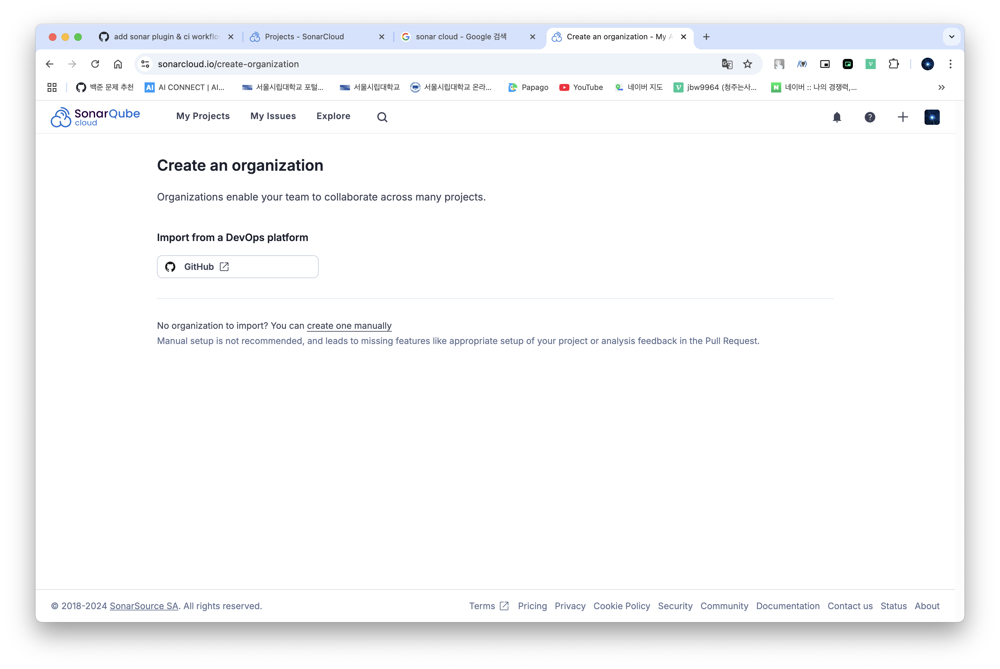

  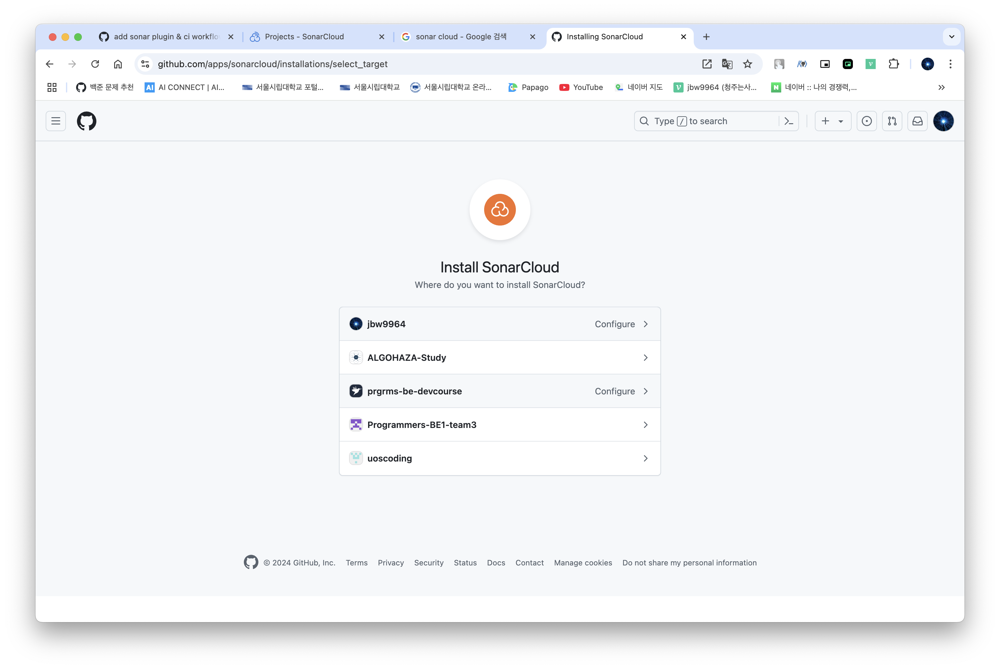

  <br>

  <body>SonarCloud 를 연결할 organization 을 선택한다</body>

  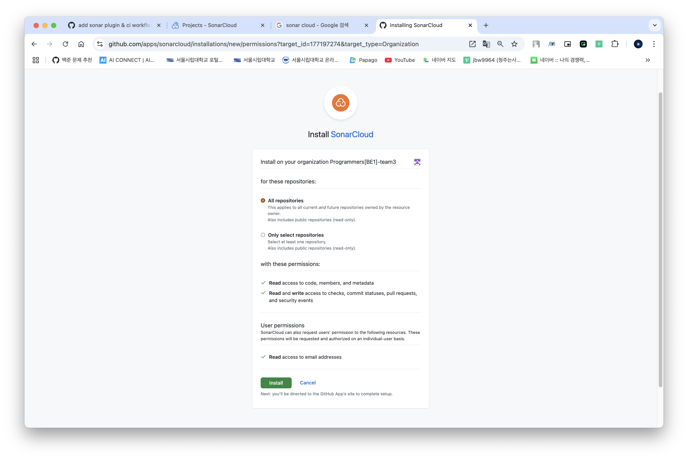

  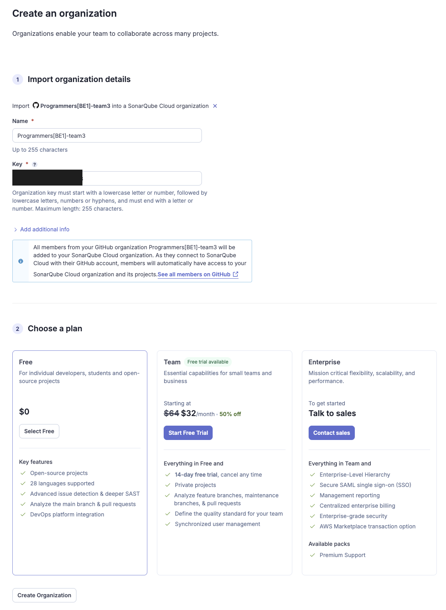
</p>

`organization` 을 연결할 때, `이름`, `key`, `plan` 을 설정할 수 있다.

`key` 가 정확히 어떤 역할인진 모르겠지만 아무튼 설정해줬다.

<!-- sonar-cloud-pre-setup-6.png -->

<p align="center">
  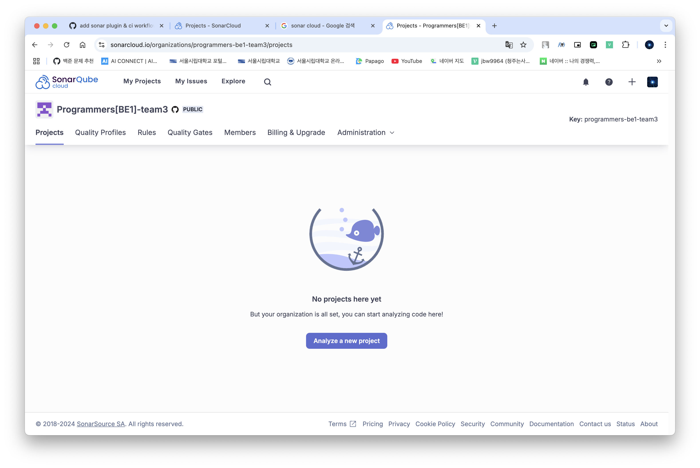
</p>

`organization` 을 처음 연결하면 아마 위 그림처럼 보일 것이다. `Analyze a new project` 를 눌러주자.

<!-- sonar-cloud-pre-setup-7.png, sonar-cloud-pre-setup-8.png -->

<p align="center">
  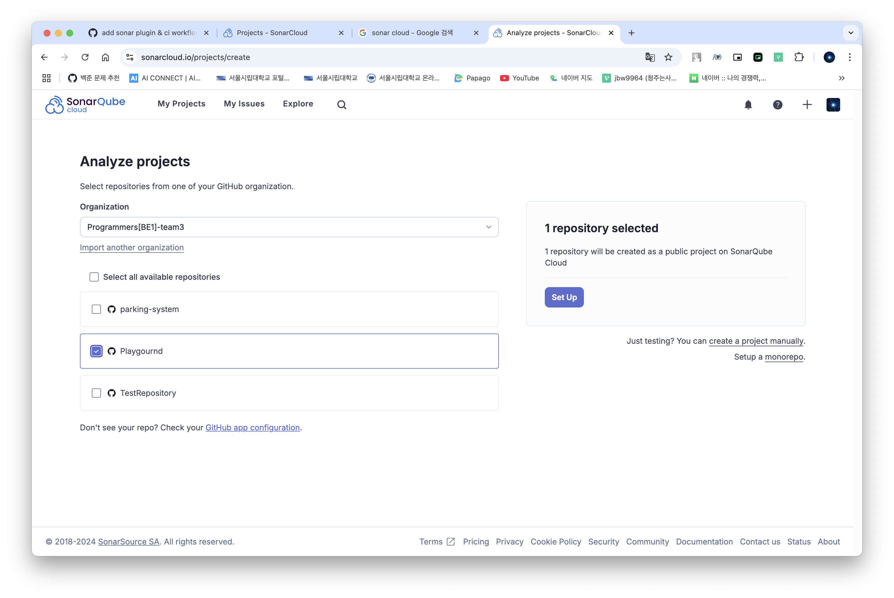

  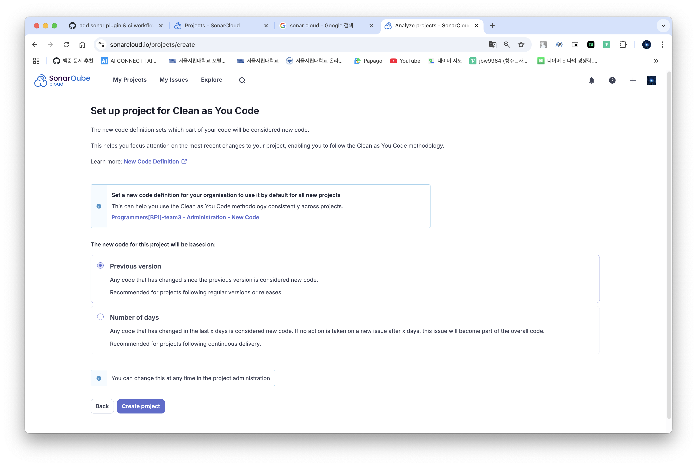
</p>

`SonarCloud` 를 적용할 `Repo` 를 선택하고, 분석 시 `new code` 의 기준을 선택해 주자.

사실 `Previous version` 과 `Number of days` 가 정확히 어떤 건지 모르겠다. 그냥 `Previous version` 으로 선택했다.

성공적으로 `Repo` 가 선택되면 아래 그림처럼 보인다.

<!-- sonar-cloud-pre-setup-9.png -->

<p align="center">
  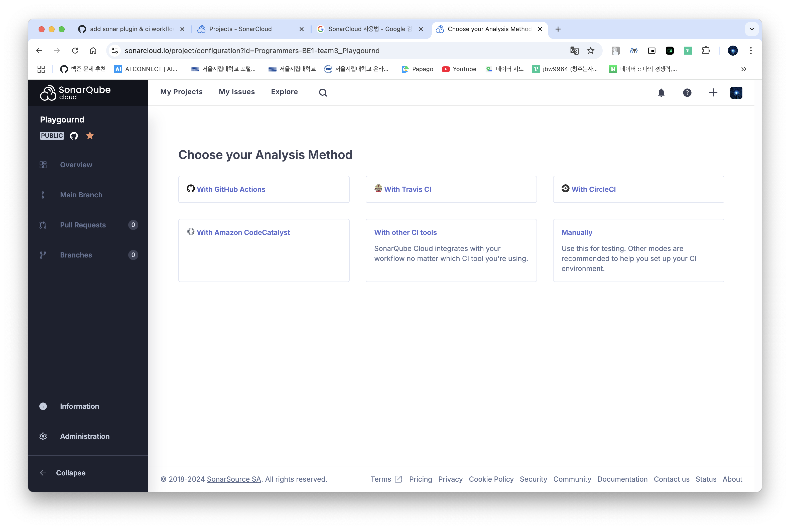
</p>

여기서 `With GitHub Actions` 를 눌러보자.

<!-- sonar-cloud-pre-setup-10.png -->

<p align="center">
  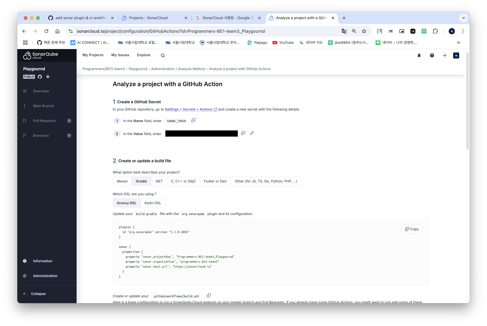
</p>

누르면 `SonarCloud` 를 `GitHub Action` 에서 어떻게 설정하는지 보여준다. 이는 크게 다음 3 가지 단계로 나뉜다.

1. `Repo` 에 `SONAR_TOKEN` 설정
2. `Sonar` `Gradle plugin` 모듈에 추가
3. `Gihub workflow` 설정

이 중 `[2]`, `[3]` 은 다음 [`[c. SonarCloud 관련 CI 추가하기]`](#c-sonarcloud-관련-ci-추가하기) 에서 다룰 것이다.

먼저 `Repo` 에 `SONAR_TOKEN` 을 설정하자.

<!--
sonar-cloud-pre-setup-11.png, 
sonar-cloud-pre-setup-12.png,
sonar-cloud-pre-setup-13.png
-->

<p align="center">
  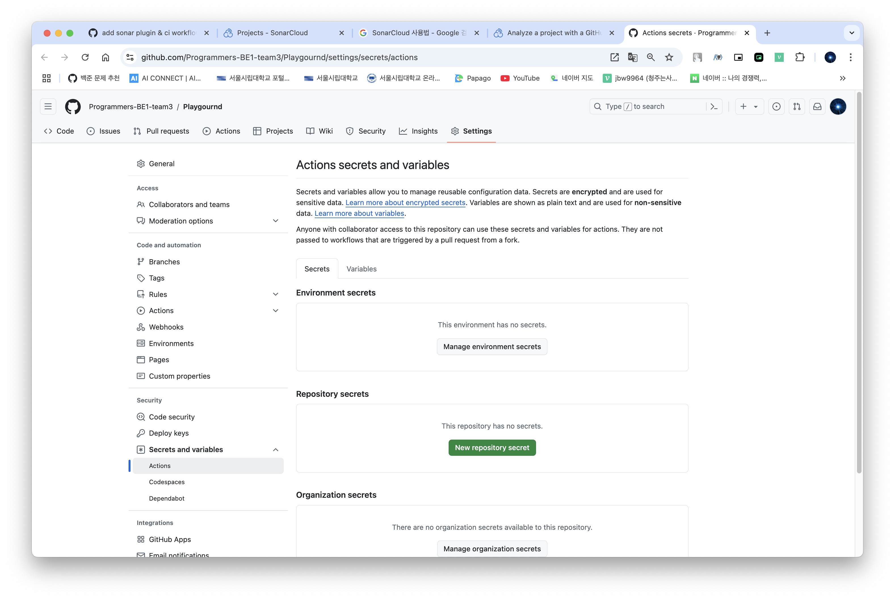

  <br>

  <body>이전 SonarCloud 에서 준 SONAR_TOKEN 값을 붙여넣어준다.</body>

  <br>

  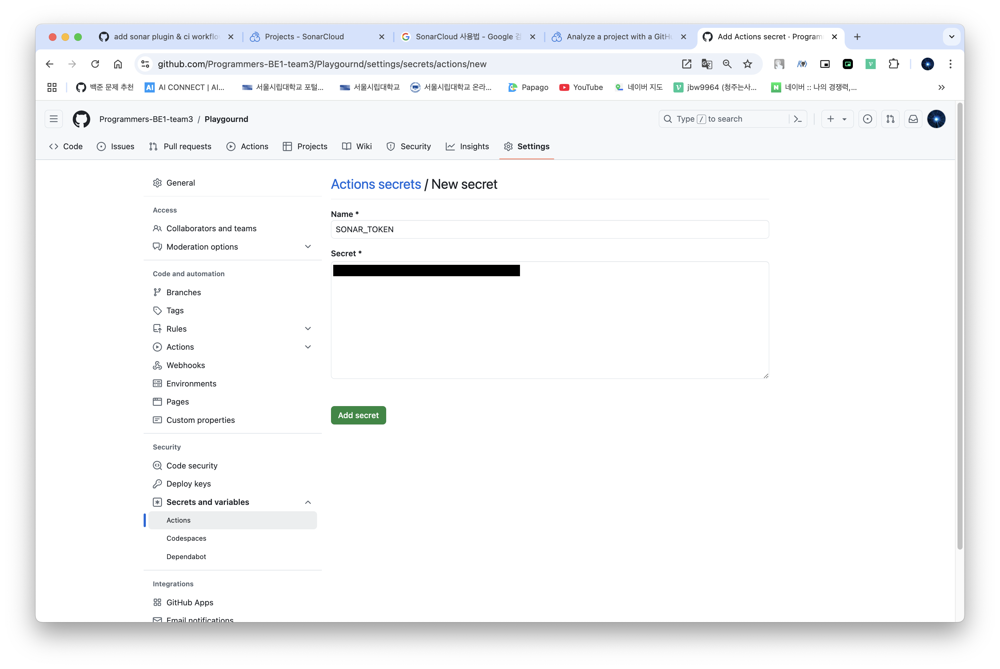

  <br>

  <body>이전 SonarCloud 에서 준 SONAR_TOKEN 값을 붙여넣어준다.</body>

  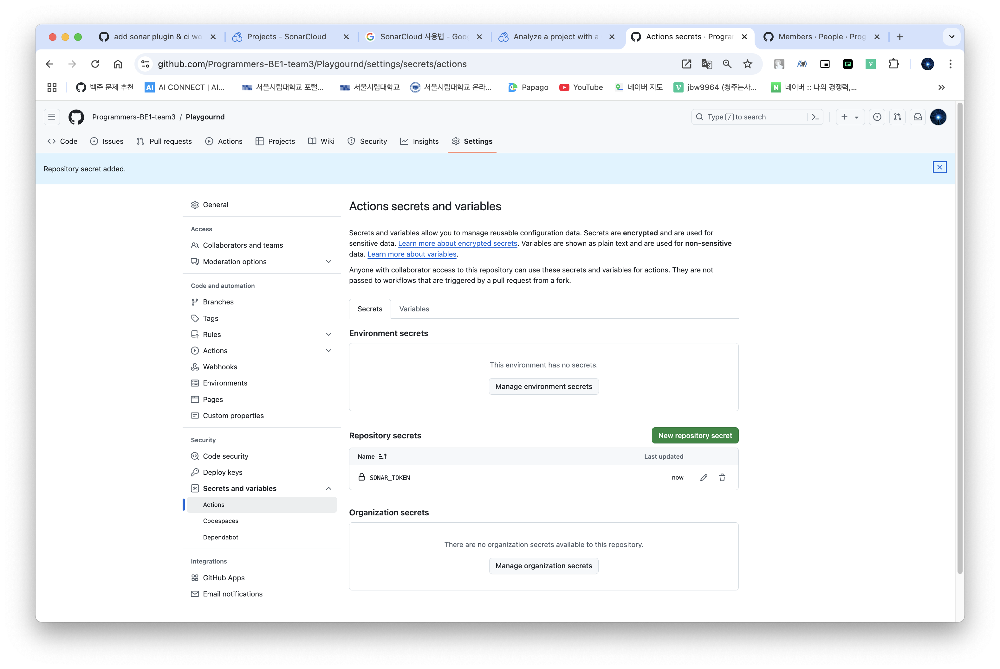

  <br>

  <body>Repo secrete 을 잘 설정하면 위 그림처럼 보인다.</body>
</p>

이러면 `SonarCloud` 원격(?) 설정은 모두 끝난 것이다.

---

### c. `SonarCloud` 관련 `CI` 추가하기

이제 로컬(?) 설정을 진행할 차례이다.

먼저 `build.gradle` 에 다음 설정을 추가하자.

```
plugins {
    
    /* ... 생략 ... */

    // sonar cloud 분석 위한 plugin
    id "org.sonarqube" version "5.1.0.4882"
}

/* ... 생략 ... */

// gradlew 에 sonar task 구성
sonar {
    properties {
        property "sonar.projectKey", "jbw9964_ci-cd-testing"
        property "sonar.organization", "jbw9964-1"
        property "sonar.host.url", "https://sonarcloud.io"
        property "sonar.language", "java"
        property "sonar.sourceEncoding", "UTF-8"
        property "sonar.sources", "src/main/java"
        property "sonar.tests", "src/test/java"
        
        // jacocoTestReport 수행 시 test report xml 파일 위치 (중요)
        property 'sonar.coverage.jacoco.xmlReportPaths', 'build/reports/jacoco/test/jacocoTestReport.xml'
        property "sonar.test.inclusions", "**/*Test.java"
        property "sonar.coverage.exclusions", "**/dto/**, **/event/**, **/*InitData*, **/*Application*, **/exception/**, **/service/alarm/**, **/aop/**, **/config/**, **/MemberRole*"
    }
}
```

이는 이전 `Jacoco` 를 추가했던 것 처럼, `plugin` 을 추가하고 `sonar` 라는 `task` 를 명시하는 스크립트이다.

이 때 특히 `sonar.projectKey`, `sonar.organization`, `sonar.host.url` 의 경우 연결한 `SonarCloud` 계정마다 다르니
주의해야 한다. `(그대로 복붙하면 위험)`

또한 `sonar.coverage.jacoco.xmlReportPaths` 로 이전 `jacocoTestReport` 시 생성되는 `report` 경로를 넣어줌에 유의하자.

여담으로 사실 `SonarCloud` `GiHub Action` 가이드 라인에는 `sonar task` 를 다음처럼 구성하라 나와 있다.

```
sonar {
  properties {
    property "sonar.projectKey", "Programmers-BE1-team3_Playgournd"
    property "sonar.organization", "programmers-be1-team3"
    property "sonar.host.url", "https://sonarcloud.io"
  }
}
```

그런데 여러 블로그 찾아보니 위처럼 그냥 해놨길래 나도 그렇게 해봤다. `(실제로 어떤 차이가 있는진 몰루. CI 로그 보니까 저 옵션들 잘 적용 안되던거 같은데..)`

이를 잘 설정하면 이전 `Jacoco` 처럼 `gradle task` 에 `sonar` 가 보이게 된다.

<!-- sonar-cloud-main-setup-1.png -->

<p align="center">
  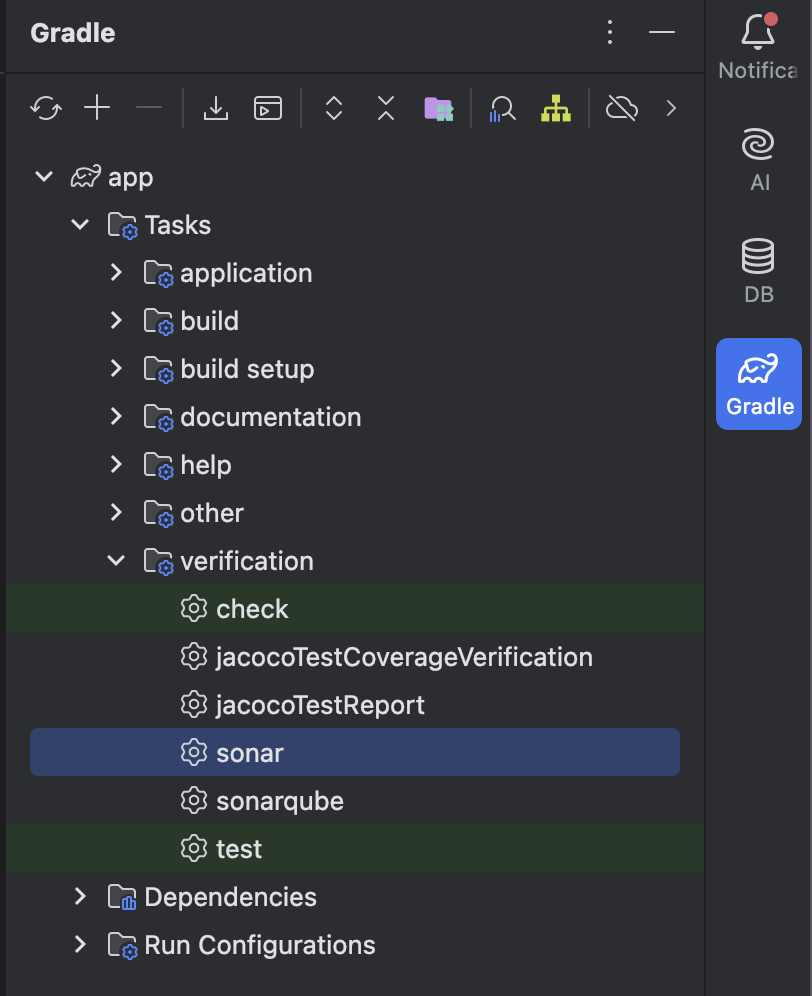
</p>

이제 마지막으로 아래 `CI` 스크립트를 추가하면 된다.

```
# Sonar Cloud 패키지 캐싱
- name: Cache SonarCloud packages
  uses: actions/cache@v4.1.2
  with:
    path: ~/.sonar/cache
    key: ${{ runner.os }}-sonar
    restore-keys: ${{ runner.os }}-sonar


# Sonar 로 코드 분석 & SonarCloud 로 결과 upload
- name: Analyze via Sonar
  env:
    GITHUB_TOKEN: ${{ secrets.GITHUB_TOKEN }}
    SONAR_TOKEN: ${{ secrets.SONAR_TOKEN }}
  run: |
    cd app
    ./gradlew sonar --info
```

이 때 `Analyze via Sonar` 이전에 `test` 가 진행되어야 한다.

`sonar task` 는 `test 실행 결과 report` 를 `SonarCloud` 로 보내기 때문이다.

`(사실 위 명제가 정확히 맞는진 모르겠지만, SonarCloud 공식 문서에도 sonar task 이전에 테스트 돌리라 명시되어 있다)`

---

## 3. 전체 `CI` 스크립트

```
# Workflow 이름
name: CI Report with Gradle & Sonar

# 트리거 이벤트
on:
  pull_request:
    branches: [ "main", "master", "develop", "release" ]

# 테스트 결과 작성을 위해 쓰기 권한 추가
permissions: write-all

# 실행
jobs:
  build:
    runs-on: ubuntu-latest

    # 실행 스텝
    steps:

      # workflow 가 repo 에 접근하기 위한 Marketplace action
      - uses: actions/checkout@v4.2.2

      # 우리 repo 디렉토리는 ~/ 아니라 그냥 ./ 임
      - name: Show CWD Properties
        run: |
          echo "Current directory : `pwd`"
          ls -al
          echo 'tree ./'
          tree ./ -a

      # jdk setup
      - name: Set up JDK 17
        uses: actions/setup-java@v4.5.0
        with:
          java-version: '17'
          distribution: 'oracle'  # 그냥 Oracle JDK


      # gradle 캐시해서 빌드 시간 단축
      - name: Gradle caching
        uses: actions/cache@v4.1.2
        with:
          # cache 저장할 폴더 설정
          path: |
            ~/.gradle/caches
            ~/.gradle/wrapper
          key: ${{ runner.os }}-gradle-${{ hashFiles('**/*.gradle*', '**/gradle-wrapper.properties') }}
          restore-keys:
            ${{ runner.os }}-gradle-


      # gradlew 실행 권한 부여
      - name: Grant Execute Permission For Gradlew
        run: |
          cd app
          chmod +x ./gradlew


      # test 없이 그냥 build
      - name: Build with Gradle
        run: |
          cd app
          ./gradlew build -x test --build-cache
      

      # 테스트 실행
      - name: Run Tests
        run: |
          cd app
          ./gradlew --info test
      

      # Pull Request 코멘트에 테스트 결과 댓글 달기
      - name: Publish Unit Test Results To PR Comment
        uses: EnricoMi/publish-unit-test-result-action@v2.18.0
        if: ${{ always() }}   # 앞에 step 이 fail 해도 실행
        with:
          files: app/build/test-results/**/*.xml


      # 테스트 실패한 부분 PR Code Review 에 주석 달기
      - name: Add Annotation to Failed Test on PR Code Review
        uses: mikepenz/action-junit-report@v5
        if: success() || failure()  # 앞에 step 이 fail 해도 실행
        with:
          # test report 위치
          report_paths: '**/build/test-results/test/*.xml'
          require_tests: true


      # Sonar Cloud 패키지 캐싱
      - name: Cache SonarCloud packages
        uses: actions/cache@v4.1.2
        with:
          path: ~/.sonar/cache
          key: ${{ runner.os }}-sonar
          restore-keys: ${{ runner.os }}-sonar


      # Sonar 로 정적 코드 분석
      - name: Analyze via Sonar
        env:
          GITHUB_TOKEN: ${{ secrets.GITHUB_TOKEN }}
          SONAR_TOKEN: ${{ secrets.SONAR_TOKEN }}
        run: |
          cd App1
          ./gradlew sonar --info
```

---